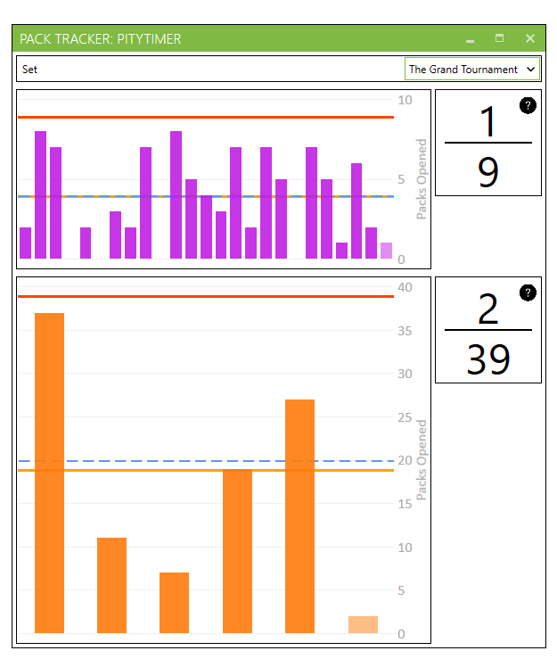
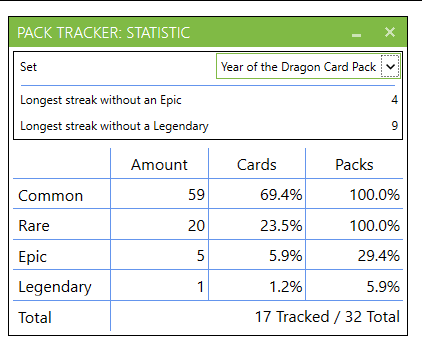
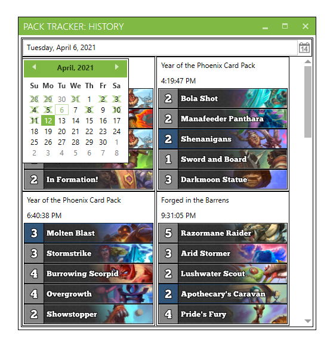
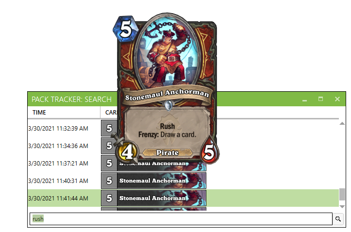
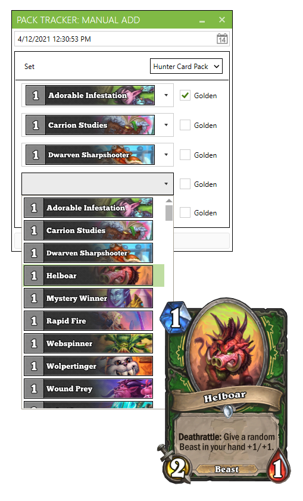

# PackTracker 
Plugin for [HearthstoneDeckTracker](https://hsdecktracker.net/)

Pack Tacker is a small but handy plugin for Hearthstone Deck Tacker that allows you to keep an eye on every pack you open. 
This allows you to see how many cards of different rarities have dropped over time and also enables you to estimate when your next Epic or Legendary is coming!

## Features  
- Tracks your pack openings
  - **Fully Automatic. No hassle with spreadsheets or any other manual input**
- Data can be represented in
  - a date-based (calender-like) history
  - a boosterpack-series-based statistic
  - a plain chronological text-log
- Supports auto-update
- Counts boosterpack-series-based **Pity Timer** for Epic and Legendary cards
  - Represented as bar charts
  - Overlay while opening packs (See your pity timers counting live)
- Show the overall amount of packs you've ever got
- Can search through card names and texts in both, english and the chosen language of your HDT at once
- **All stored locally. No hassle with overloaded webpages on release days**

[Download](https://github.com/sgkoishi/PackTracker/releases/latest)  and unzip  
[How to add plugins to HDT](https://github.com/HearthSim/Hearthstone-Deck-Tracker/wiki/Available-Plugins)

## Screenshots

#### Pity Timers  

#### Statistic  

#### History  
  

#### Log  

#### Search  

#### Manual Add  
